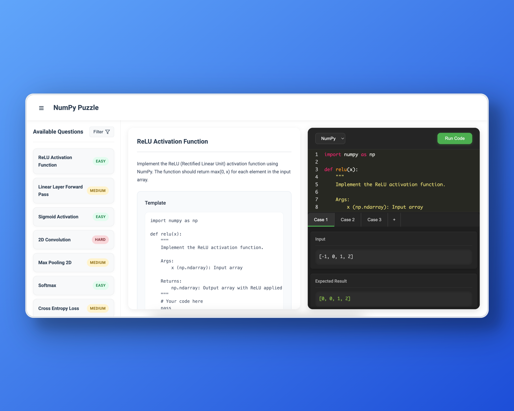

# NumPy Puzzle



An interactive web application for practicing NumPy implementations of common neural network operations. This project helps you understand the fundamentals of deep learning by implementing various neural network components from scratch using NumPy.


## Features

- Interactive code editor with syntax highlighting
- Real-time code execution via a serverless backend
- Multiple difficulty levels (Easy, Medium, Hard)
- Various categories of neural network operations:
  - Activation Functions
  - Linear Layers
  - Convolution Operations
  - Pooling Layers
  - Regularization Techniques
  - Normalization Layers
  - Loss Functions
- Test cases for each implementation
- Filter questions by difficulty and category
- Deployable via Vercel

## Prerequisites

- Python 3.8 or higher
- pip (Python package installer)
- Vercel CLI (for local development and deployment)
- A modern web browser


## Installation

1. Clone the repository:
```bash
git clone https://github.com/egghao/numpy_puzzle.git
cd numpy_puzzle
```

2. Install Python dependencies:
```bash
pip install -r requirements.txt
```

3. Install Vercel CLI:
```bash
npm install -g vercel
```

4. Log in to Vercel:
```bash
vercel login
```

## Running Locally (using Vercel CLI)

To run the application locally, including the serverless backend simulation:

```bash
vercel dev
```

This command starts a local development server (usually on `http://localhost:3000`) that mimics the Vercel environment, serving both the frontend and the Python API.

## Deployment

This project is configured for easy deployment using Vercel.

1. Ensure you have committed your latest changes:
```bash
git add .
git commit -m "Prepare for Vercel deployment"
git push # (if deploying from a remote repo)
```

2. Deploy to Vercel:
```bash
vercel
```

Follow the prompts from the Vercel CLI. After deployment, Vercel will provide you with a public URL for your application.


## Project Structure

```
.
├── api/
│   └── index.py         # Python serverless function (Flask app)
├── public/
│   ├── index.html       # Static frontend files
│   ├── styles.css
│   ├── script.js
│   └── screenshot.png   # Application screenshot
├── .gitignore           # Git ignore file
├── requirements.txt     # Python dependencies
├── vercel.json          # Vercel deployment configuration
└── README.md            # This file
```

## Contributing

Feel free to submit issues and enhancement requests!

## License

[MIT License](LICENSE) 